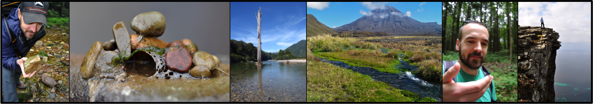
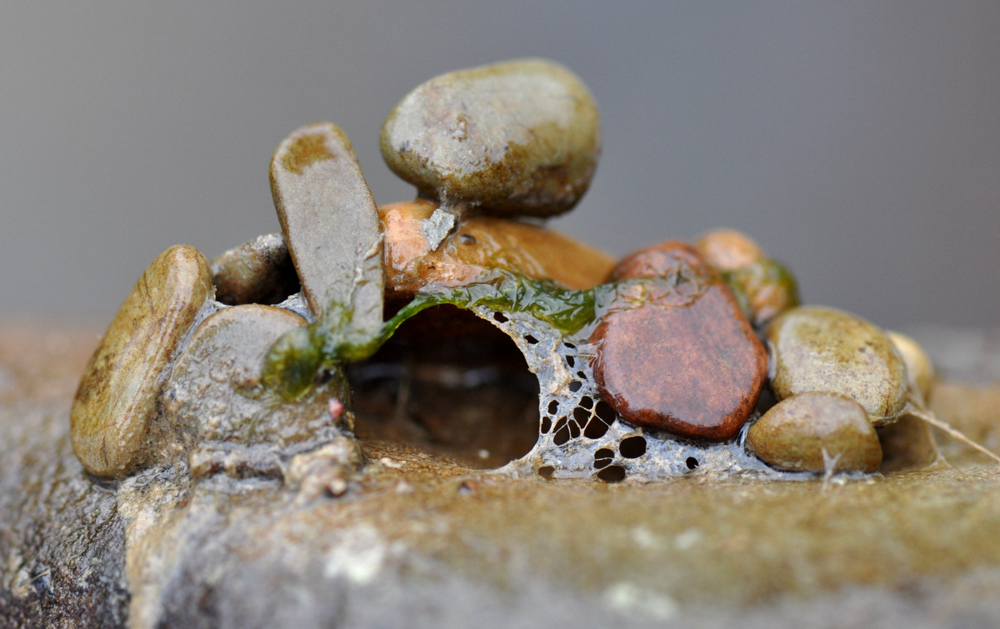
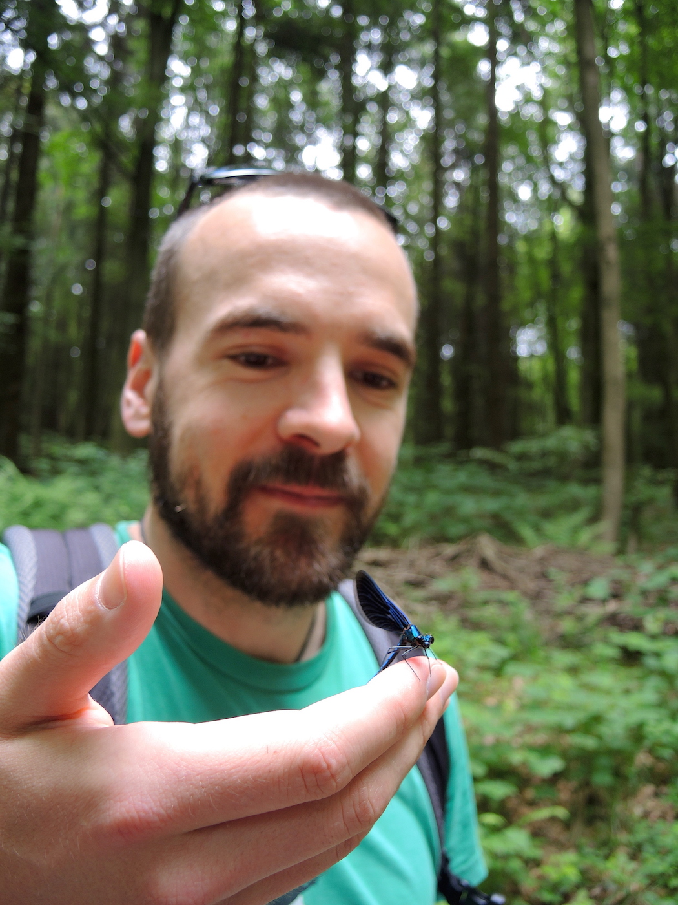
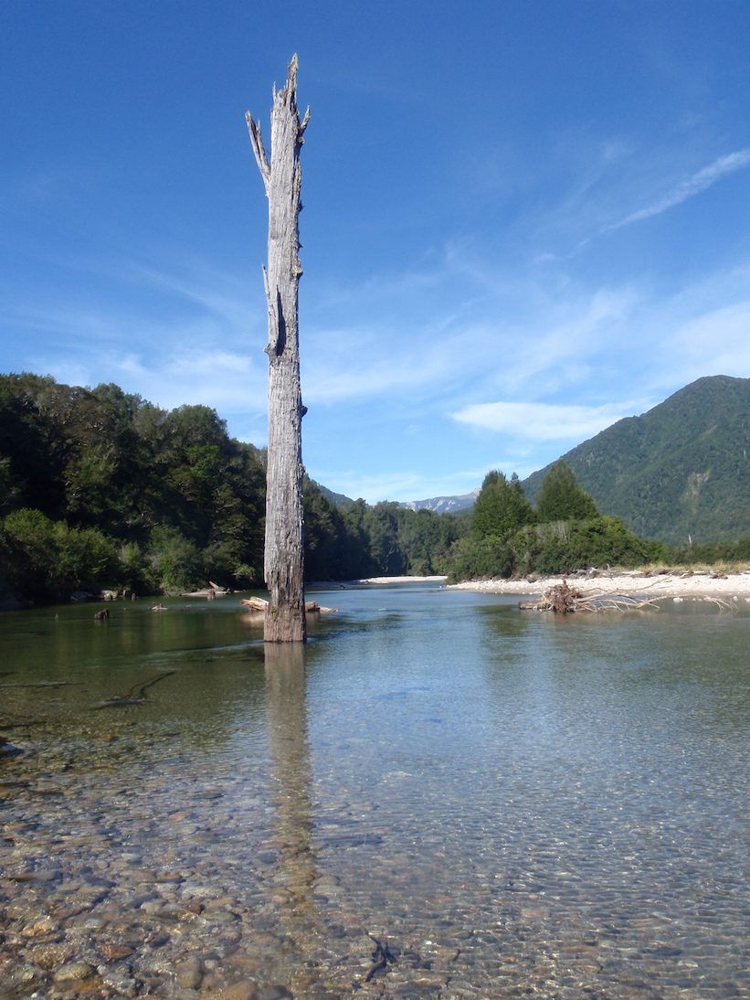
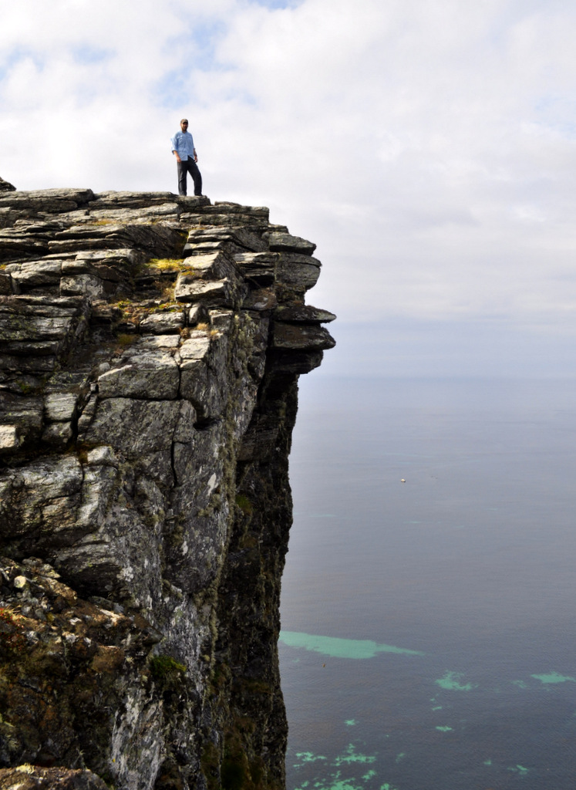
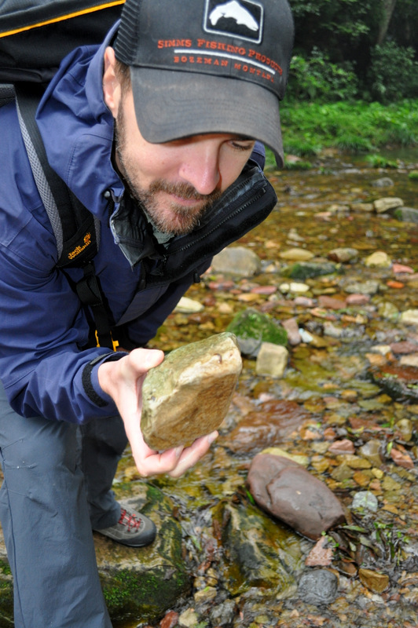
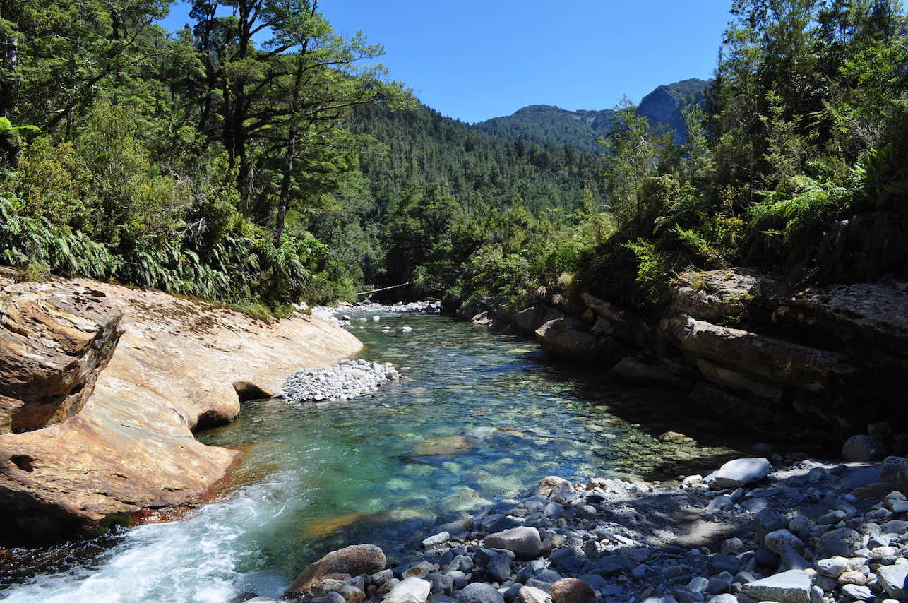

I am a postdoctoral scholar at <a href="http://oregonstate.edu/">Oregon State University</a> in Corvallis, OR, USA. I'm based in the <a href="http://ib.oregonstate.edu/">Department of Integrative Biology</a>. Read more about my [research](research) and [publications](publications).  

Prior to this, I gained a PhD from [Massey University](http://www.massey.ac.nz/) in New Zealand looking at the interaction between productivity and disturbance on structuring stream invertebrate diversity patterns. I followed that up with a job lecturing in Environmental Management and Marine Studies at [Bay of Plenty Polytechnic](http://www.boppoly.ac.nz/) in Tauranga, New Zealand. I then spent one year at [Xi’an Jiaotong-Liverpool University](http://www.xjtlu.edu.cn/en/) in Suzhou, China lecturing Environmental Science. I followed that up by a couple of years at [Senckenberg](http://www.senckenberg.de/root/index.php?page_id=71) Research Institute and Natural History Museum in Germany, based in the River Ecology and Conservation [Department](http://www.senckenberg.de/root/index.php?page_id=5217&organisation=true&institutID=1&abteilungID=26) in Gelnhausen.

# Research Interests
- Stream ecology
- Community ecology
- Metacommunity ecology
- Large-scale biodiversity patterns
- Ecosystem function
- Global change
- Restoration ecology

# Academic Positions

**October 2015 – Present:** Postdoctoral scholar at [Oregon State University](http://oregonstate.edu/) in Corvallis, OR, USA, based in the [Department of Integrative Biology](http://ib.oregonstate.edu/).  
**September 2013 – September 2015:** Postdoctoral Researcher at [Senckenberg](http://www.senckenberg.de/root/index.php?page_id=71) Research Institute and Natural History Museum, Gelnhausen, Germany.   
**August 2012 – August 2013:** Lecturer at [Xi’an Jiaotong-Liverpool University in Suzhou](http://www.xjtlu.edu.cn/en/), SIP, Suzhou, Jiangsu Province, China.  
**February 2011 – July 2012:** Academic Staff Member at [Bay of Plenty Polytechnic](http://www.boppoly.ac.nz/), Tauranga, New Zealand.  

# Education

**PhD in Ecology**, [Massey University](http://www.massey.ac.nz/), New Zealand, 2012. Thesis title: “The effects of productivity and disturbance on diversity in stream communities” - Supervisors: Russell Death, Mike Joy, Kevin Collier   
**BSc (Hons) 1st Class in Ecology**, [Massey University](http://www.massey.ac.nz/), New Zealand, 2006. Thesis title: “The effects of flow regulation on macroinvertebrate drift in the Tongariro River, New Zealand”   
**BSc in Ecology**, [Massey University](http://www.massey.ac.nz/), New Zealand, 2005   

# Societies I'm a member of
- [New Zealand Freshwater Sciences Society (NZFSS)](http://freshwater.science.org.nz/index.php/)
- [Society for Freshwater Science (SFS; formerly NABS)](http://www.freshwater-science.org/default.aspx)
- [International Society for River Science (ISRS)](http://riversociety.org/)
- [British Ecological Society (BES)](http://www.britishecologicalsociety.org/)

# Editorial Boards
[Freshwater Biology](http://onlinelibrary.wiley.com/journal/10.1111/(ISSN)1365-2427)
[PeerJ](https://peerj.com/)

# Contact details

<!-- pure-img makes image scalable-->

<!--

-->

**Jonathan D. Tonkin**  
Department of Integrative Biology
3029 Cordley Hall
Oregon State University
Corvallis, OR, USA

<i class="fa fa-fw fa-globe"></i>[ oregonstate.edu](http://oregonstate.edu)  
<i class="fa fa-fw fa-envelope"></i><a href="mailto:jdtonkin@gmail.com"> jdtonkin [at] gmail.com</a>     
<i class="fa fa-fw fa-envelope-o"></i><a href="mailto:tonkinj@oregonstate.edu"> tonkinj [at] oregonstate.edu</a>     
<i class="fa fa-fw fa-twitter"></i><a href="http://twitter.com/jdtonkin"> @jdtonkin</a>

Also find me on [researchgate](https://www.researchgate.net/profile/Jonathan_Tonkin/), [academia.edu](http://senckenberg.academia.edu/JonathanTonkin), [figshare](http://figshare.com/authors/Jonathan%20D%20Tonkin/277559), [google scholar](http://scholar.google.co.nz/citations?user=Mtn0TIwAAAAJ&hl=en), and [twitter](https://twitter.com/jdtonkin).

