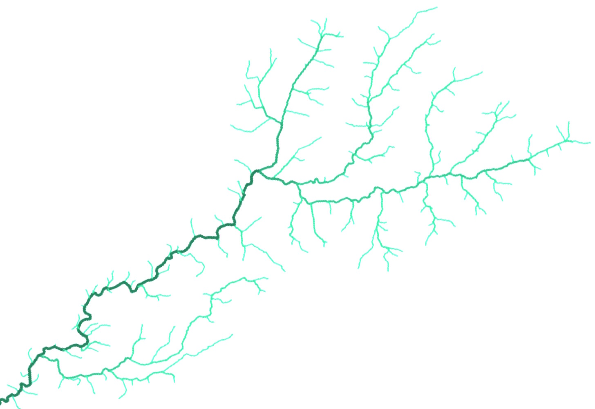

   

  

I study factors that promote and maintain biodiversity from a community, metacommunity and macroecological perspective. My research has mostly focused on running water ecosystems, but my interests are question focused, not system specific. 

I am currently a postdoctoral researcher at [Senckenberg](http://www.senckenberg.de/root/index.php?page_id=71) Research Institute and Natural History Museum in Germany. I’m based in the River Ecology and Conservation [Department](http://www.senckenberg.de/root/index.php?page_id=5217&organisation=true&institutID=1&abteilungID=26) in Gelnhausen, Germany. You can read more about [me](about) (including contact details), my [research](research), and my [publications](publications) on my website. 

<!--
<i class="fa fa-fw fa-envelope"></i> jdtonkin [at] gmail.com   
<i class="fa fa-fw fa-envelope-o"></i> jonathan.tonkin [at] senckenberg.de   
<i class="fa fa-fw fa-twitter"></i> @jdtonkin   
-->
<a href="https://twitter.com/jdtonkin" class="twitter-follow-button" data-show-count="false">Follow @jdtonkin</a>

