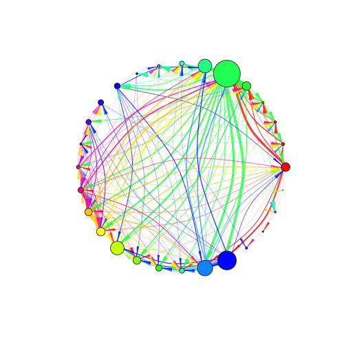

<!-- pure-img makes image scalable-->

<!--  -->

<!-- <iframe src="{{ "assets/network/network.html" | absolute_url }}" width="300px" height="300px" frameBorder="0" style=" border-width:0 "> -->
<!-- </iframe> -->

I study factors that promote and maintain biodiversity from a community, metacommunity and macroecological perspective. I am currently a postdoctoral fellow at <a href="https://www.canterbury.ac.nz/">the University of Canterbury</a> in Christchurch, New Zealand. I'm on the editorial boards of <a href="http://onlinelibrary.wiley.com/journal/10.1111/(ISSN)1365-2427">Freshwater Biology</a> and <a href="https://peerj.com/">PeerJ</a>. You can read more about <a href="/about">me</a> (including contact details), my <a href="/research">research</a>, and my <a href="/publications">publications</a> on this website. 

## Latest news

<!-- TEMPLATE:  DATE » **TITLE**-->

4 Oct 2018 » **Awarded a Rutherford Discovery Fellowship.** I am delighted and honoured to receive a Rutherford Discovery Fellowship from the Royal Society of New Zealand Te Apārangi. The title of my 5-year programme is "Rethinking ecological networks in changing environments". The fellowship will allow me to build my research programme here in New Zealand after several years overseas, and provide the time to tackle major environmental challenges in a way that is not necessarily possible over shorter timescales. News releases [here](https://royalsociety.org.nz/news/2018-rutherford-discovery-fellowships-to-accelerate-research-careers-announced/) and [here](https://www.canterbury.ac.nz/news/2018/uc-ecologist-awarded-800000-to-tackle-major-environmental-challenges.html). 

20 Sept 2018 » **New paper in Biological Reviews.** We just published a paper in Biological Reviews on "Reintroduction of freshwater macroinvertebrates: challenges and opportunities". This was a fund paper to be a part of. Thanks Jonas for leading! Find the paper over on my publications page or [here](http://doi.org/10.1111/brv.12458). 

3 Sept 2018 » **Started new position in NZ.** I'm delighted to share that I have just started a new postdoc position at the [University of Canterbury](https://www.canterbury.ac.nz/) in New Zealand. Six exciting years overseas (China-Germany-USA) has come to an end. I'm delighted to be working with [Prof. Jason Tylianakis](https://www.tylianakislab.org/) and Prof. Ian Dickie on above- and below-ground ecological networks. 

16 July 2018 » **New paper in Limnologica.** We've just had a paper accepted in [Limnologica](https://doi.org/10.1016/j.limno.2018.06.003) on: Dispersal capacity and broad-scale landscape structure shape benthic invertebrate communities along stream networks. Thanks to Fengqing for leading this! 

14 July 2018 » **New paper in Conservation Biology.** We've just had a paper accepted in [Conservation Biology](https://doi.org/10.1111/cobi.13176) on: Diverging response patterns of terrestrial and aquatic species to hydromorphological restoration. Thanks to Francesca for leading this! 

8 June 2018 » **Great week at SFS.** I recently attended the annual Society for Freshwater Science meeting in Detroit. I'm really excited by how well the two special sessions I co-led went. One was on "Emerging Approaches to Modeling Population and Community Dynamics in Fresh Waters" (co-leads: Albert Ruhi, Julian Olden and Dave Lytle) and the other was on "Dams, big data, and meta-analyses" (led by Erin Abernethy). Thanks to all the presenters and those that attended the sessions!

14 May 2018 » **Paper accepted in PeerJ.** Happy to have just had a paper accepted for publication in *PeerJ* looking at latitudinal variation in metacommunity structure in New Zealand stream invertebrates. More details soon. 

12 May 2018 » **Off to NCEAS in Santa Barbara.** I'm heading to NCEAS (National Center for Ecological Analysis and Synthesis) in Santa Barbara for an exciting week of discussions on long-term metacommunity synthesis. 

22 Apr 2018 » **Special issue on river network metacommunities.** I recently edited a special issue in Freshwater Biology with Florian Altermatt and Jani Heino on metacommunities in river networks. You can find the special issue [here](https://onlinelibrary.wiley.com/toc/13652427/63/1), our editorial [here](http://dx.doi.org/10.1111/fwb.13045), and our review of dispersal in river networks [here](http://dx.doi.org/10.1111/fwb.13037). You can find pdfs [here](publications). 

21 Apr 2018 » **Redesign of site = more news.** I've just redesigned my site to enable easier dissemination of news, so expect a lot more updates from now on. Also, I'm moving any blog posts back here to keep it all centralised. 

10 Apr 2018 » **New paper.** We just published a paper in [Science of the Total Environment](http://dx.doi.org/10.1016/j.scitotenv.2017.11.242) showing that preceding year climatic conditions outweigh long-term climatic trends on stream invertebrate communities in Europe. 

10 Feb 2018 » **New paper on EBVs.** We've just published a paper on linking essential biodiversity variables (EBVs) and ecological integrity for the next generation of site-based long-term ecological monitoring at [Science of the Total Environment](http://dx.doi.org/10.1016/j.scitotenv.2017.08.111). I hope this thinking gets implemented in LTER. This is something I started back when I worked at Senckenberg in Germany so it's great to see it out! Thanks to co-leads, Peter and Stefan, as well as all co-authors. 

24 Jan 2018 » **New paper in Nature Ecology and Evolution.** Very excited to have a new paper out in [Nature Ecology and Evolution](http://dx.doi.org/10.1038/s41559-017-0379-0) on ecological networks in uncertain futures. Find a short overview [here](blog/2018/01/24/New-Paper-In-NEE) and a full 'behind the paper' writeup [here](https://natureecoevocommunity.nature.com/users/70479-jonathan-tonkin/posts/22255-networks-degrade-when-river-flows-depart-from-natural). Thanks to my coauthors Dave, Dave, Julian and Lindsay! PDF [here](publications). 

24 Jan 2018 » **New paper in Ecology Letters recommended on f1000.** We recently published a paper in [Ecology Letters](http://dx.doi.org/10.1111/ele.12866) where we develop a model to explore the countervailing effects of disturbance on population dynamics. In this paper, we derived a novel form of the logistic growth equation that permits time-varying carrying capacity and growth rate. Find the f1000 recommendation [here](https://f1000.com/prime/732394087). Thanks Laura, Dave and Patrick! PDF [here](publications). 

23 Jun 2017 » **Joining Freshwater Biology Editorial Board.** I'm very excited to announce that I have recently joined the Editorial Board of [Freshwater Biology](http://onlinelibrary.wiley.com/journal/10.1111/(ISSN)1365-2427). I've always thought of Freshwater Biology as the flagship freshwater specific journal, so I'm super excited and honoured by the opportunity to be a part of the team there.

12 Jun 2017 » **Featured on the SFS Making Waves podcast.** I was recently featured on the Society for Freshwater Science's [Making Waves](http://www.freshwater-science.org/Education-and-Outreach/Media/Podcast.cfm) podcast. This was a really great opportunity to share some recent research of ours, including our paper on seasonality and some of our recent population modeling work. You can find the podcast [here](https://youtu.be/mqnuv6YZBSM).

26 Apr 2017 » **New paper in Ecology.** We have a new paper out in [Ecology](http://dx.doi.org/10.1002/ecy.1761). This deals with the role of seasonality and predictability in environmental fluctuations on temporal species diversity. We show that understanding the role of seasonality in regulating biodiversity is not complete without and understanding of its predictability. We developed a framework for examining these aspects by combining wavelets and information theory. Thanks to my excellent co-authors (Mike, Nuria, Blanca, and Dave) for making this a great experience. I will write a brief blog post on this soon. PDF [here](publications).

Older news [here](news).  

## Latest blogs

<ul class="posts">
<!-- the below show's the latest 3 posts and adds a bit of text (first 20 words) from post as well as the title-->
	  
	    <li>{{ post.date | date_to_string }} » <a href="{{ post.url }}" title="{{ post.title }}">{{ post.title }}</a> »
	    {{ post.content | strip_html | truncatewords:20}}
	    <a href="{{ post.url }}">Read more...</a></li>
	     
	  
	</ul>

## Featured papers

	
	

 
	

	
	

			

Tonkin, J. D., J. D. Olden, D. M. Merritt, L. V. Reynolds, and D. A. Lytle. 2017. Flow regime alteration degrades ecological networks in riparian ecosystems. <a href="http://dx.doi.org/10.1038/s41559-017-0379-0" target="_blank">Nature Ecology & Evolution</a> DOI:10.1038/s41559-017-0379-0.

 
	

 	
	

	
	

 
	

	
	

			

Tonkin, J. D., M. T. Bogan, N. Bonada, B. Rios-Touma, and D. A. Lytle. 2017. Seasonality and predictability shape temporal species diversity. <a href="http://dx.doi.org/10.1002/ecy.1761" target="_blank">Ecology</a> DOI:10.1002/ecy.1761. <a href="http://jdtonkin.github.io/publications/2017_Tonkin_etal_Ecology.pdf"><i class="fa fa-fw fa-file-pdf-o"></i></a>

 
	

 	
	

## Special issue on river networks 

I recently edited a special issue in Freshwater Biology with Florian Altermatt and Jani Heino on metacommunities in river networks. You can find the special issue [here](https://onlinelibrary.wiley.com/toc/13652427/63/1)

Tonkin, J. D., J. Heino, and F. Altermatt. 2018. Editorial: Metacommunities in river networks: the importance of network structure and connectivity on patterns and processes. <a href="http://dx.doi.org/10.1111/fwb.13045" target="_blank"> Freshwater Biology </a> 63:1-5. [<i class="fa fa-fw fa-file-pdf-o"></i>]({{ "/assets/pdfs/2018_Tonkin_etal_Freshwater_Biology_Editorial.pdf" | absolute_url }})

We compiled a series of papers with the aim of highlighting the importance of the river network on structuring biodiversity, particularly through metacommunity dynamics and associated dispersal processes. The issue covers a wide range of topics (from disease spread and nutrient uptake to trophic dynamics), approaches (from field and lab experiments to modelling and population genetics), taxonomic foci (from diatoms and protists to fish), and geographic locations (from the tropics to the subarctic). 

<!--
<i class="fa fa-fw fa-envelope"></i> jdtonkin [at] gmail.com   
<i class="fa fa-fw fa-envelope-o"></i> jonathan.tonkin [at] senckenberg.de   
<i class="fa fa-fw fa-twitter"></i> @jdtonkin   
-->
<!--<a href="https://twitter.com/jdtonkin" class="twitter-follow-button" data-show-count="false">Follow @jdtonkin</a>

-->
