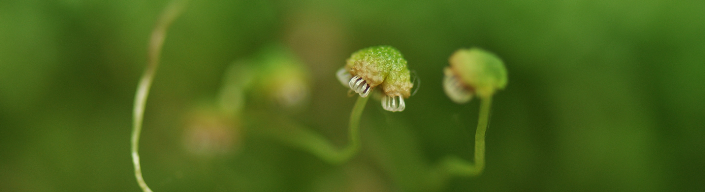

# Societies I'm a member of
- [New Zealand Freshwater Sciences Society](http://freshwater.science.org.nz/index.php/) (NZFSS)
- [Society for Freshwater Science](http://www.freshwater-science.org/default.aspx) (SFS; formerly NABS)
- [International Society for River Science](http://riversociety.org/) (ISRS)
- [British Ecological Society](http://www.britishecologicalsociety.org/) (BES)

# Places I've worked or studied
- [Senckenberg](http://www.senckenberg.de/root/index.php?page_id=71) Research Institute and Natural History Museum   
- [Xi’an Jiaotong-Liverpool University](http://www.xjtlu.edu.cn/en/)   
- [Bay of Plenty Polytechnic](http://www.boppoly.ac.nz/)   
- [Massey University](http://www.massey.ac.nz/)  
 

# Blogs I follow
- [Dynamic Ecology](http://dynamicecology.wordpress.com/)  
- [ConservationBytes](http://conservationbytes.com/)  
- [Small Pond Science](http://smallpondscience.com/)  
- [The EEB and Flow](evol-eco.blogspot.com)
- [i'm a chordata! urochordata!](http://www.imachordata.com/)  
- [Jaberwocky Ecology](http://jabberwocky.weecology.org/)  

# Graphing tools
- [ggplot](http://docs.ggplot2.org/current/) R package  
- [colorbrewer.org](http://colorbrewer2.org/) - a great site for getting colour schemes, which can be incorporated into R plots with *rcolorbrewer*  
- [colorhexa](http://www.colorhexa.com/) - more on colour schemes  
 
