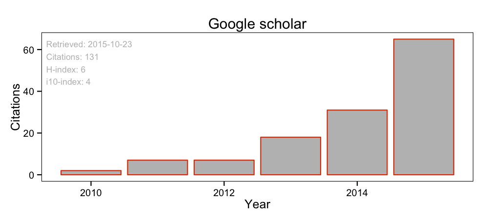

<!--
#00a1e1 - blue
#e14000 - orange
#999 - grey
#333 - black

[<i class="fa fa-fw fa-file"></i>]()
[<i class="fa fa-fw fa-file-o"></i>]()
[<i class="fa fa-fw fa-file-video-o"></i>]()
[<i class="fa fa-fw fa-file-text"></i>]()  
[<i class="fa fa-fw fa-file-text-o"></i>]
[<i class="fa fa-fw fa-file-code-o"></i>]
[<i class="fa fa-fw fa-file-pdf-o"></i>]
[<i class="fa fa-fw fa-files-o"></i>]
[<i class="fa fa-fw fa-database"></i>]
[<i class="fa fa-fw fa-files-o"></i>]
[<i class="fa fa-fw fa-code"></i>]
[<i class="fa fa-fw fa-table"></i>]

-->

<i class="fa fa-fw fa-file-pdf-o"></i> Link to published PDF  
<i class="fa fa-fw fa-file-text-o"></i> Link to preprint  
<i class="fa fa-fw fa-table"></i> Link to data  
<i class="fa fa-fw fa-code"></i> Link to code  
<i class="fa fa-fw fa-file-video-o"></i> Link to video footage  
<i class="fa fa-fw fa-unlock"></i> Open access  
<i class="fa fa-fw fa-photo"></i> Cover photo  

You can also find my publications on [researchgate](https://www.researchgate.net/profile/Jonathan_Tonkin/), [google scholar](http://scholar.google.co.nz/citations?user=Mtn0TIwAAAAJ&hl=en) and various supplementary material and pdfs of my presentations on [figshare](http://figshare.com/authors/Jonathan%20D%20Tonkin/277559).

<!--

-->

# Journal articles  

<!-- template for pub:

<a href="http://dx.doi.org/" target="_blank"> JOURNAL </a> ISSUE/DOI. [<i class="fa fa-fw fa-file-pdf-o"></i>](.pdf)

-->

**2018 and In press**  

 [46] Dalu, T., M. L. Magoro, **J. D. Tonkin**, L. R. D. Human, R. Perissinotto, S. H. P. Deyzel, J. B. Adams, and A. K. Whitfield. (*In press*). Assessing phytoplankton composition and structure within micro-estuaries and micro-outlets: A community analysis approach. *Hydrobiologia*.

 [45] Wetzel, F. T., H. Bingham, Q. Groom, P. Haase, U. Köljalg, M. Kuhlmann, C. S. Martin, L. Penev, T. Robertson, H. Saarenmaa, D. S. Schmeller, S. Stoll, **J. D. Tonkin**, and C. Häuser. *In press*. Unlocking biodiversity data - Prioritization and filling the gaps in biodiversity observation data in Europe. *Biological Conservation*.

 [44] Jourdan, J, R. B. O'Hara, R. Bottarin, T. Hiura, K. Huttunen, M. Kuemmerlen, D. Monteith, T. Muotka, T. Ohta, R. Paavola, F. Pilotto, G. Springe, S. Stoll, A. Sundermann, **J. D. Tonkin**, and P. Haase. 2018. Effects of changing climate on European stream invertebrate communities: a long-term data analysis. <a href="http://dx.doi.org/10.1016/j.scitotenv.2017.11.242" target="_blank">Science of the Total Environment</a> DOI:10.1016/j.scitotenv.2017.11.242. [<i class="fa fa-fw fa-file-pdf-o"></i>]({{ "/assets/pdfs/2018_Jourdan_etal_STOTEN.pdf" | absolute_url }})

 [43] **Tonkin, J. D.**, J. D. Olden, D. M. Merritt, L. V. Reynolds, and D. A. Lytle. 2018. Flow regime alteration degrades ecological networks in riparian ecosystems. <a href="http://dx.doi.org/10.1038/s41559-017-0379-0" target="_blank">Nature Ecology & Evolution</a> 2:86-93. [<i class="fa fa-fw fa-file-pdf-o"></i>]({{ "/assets/pdfs/2017_Tonkin_etal_Nature_Eco_Evo.pdf" | absolute_url }})

 [42] **Tonkin, J. D.**, F. Altermatt, D. Finn, J. Heino, J. D. Olden, S. U. Pauls, and D. A. Lytle. 2018. The role of dispersal in river network metacommunities: patterns, processes, and pathways. <a href="http://dx.doi.org/10.1111/fwb.13037" target="_blank">Freshwater Biology</a> 63:141–163. [<i class="fa fa-fw fa-file-pdf-o"></i>]({{ "/assets/pdfs/2018_Tonkin_etal_Freshwater_Biology.pdf" | absolute_url }})

 [41] Haase, P.\*, **J. D Tonkin**\*, S. Stoll\*, B. Burkhard, M. Frenzel, I. R. Geijzendorffer, C. Haeuser, S. Klotz, I. Kühn, W. H. McDowell, M. Mirtl, F. Müller, M. Musche, J. Penner, S. Zacharias, and D. S. Schmeller. 2018. The next generation of site-based long-term ecological monitoring: Linking Essential Biodiversity Variables and Ecosystem Integrity. <a href="http://dx.doi.org/10.1016/j.scitotenv.2017.08.111" target="_blank">Science of the Total Environment</a> 613–614:1376-1384. [<i class="fa fa-fw fa-file-pdf-o"></i>]({{ "/assets/pdfs/2018_Haase_etal_STOTEN.pdf" | absolute_url }})
\* Contributed equally

**2017**  

 [40] McMullen, L. E., P. DeLeenheer, **J. D. Tonkin**, and D. A. Lytle. 2017. High mortality and enhanced recovery: modeling the countervailing effects of disturbance on population dynamics. <a href="http://dx.doi.org/10.1111/ele.12866" target="_blank">Ecology Letters</a> DOI:10.1111/ele.12866. [<i class="fa fa-fw fa-file-pdf-o"></i>]({{ "/assets/pdfs/2017_McMullen_etal_Ecology_Letters.pdf" | absolute_url }})

 [39] Dalu, T., R. J. Wasserman, **J. D. Tonkin**, T. Mwedzi, M. Magoro, and O. L. F Weyl. 2017. Water or sediment? Partitioning the role of water column and sediment chemistry as drivers of macroinvertebrate communities in an austral South African stream. <a href="http://dx.doi.org/10.1016/j.scitotenv.2017.06.267" target="_blank">Science of the Total Environment</a> 607-608:317-325. [<i class="fa fa-fw fa-file-pdf-o"></i>]({{ "/assets/pdfs/2017_Dalu_etal_STOTEN_b.pdf" | absolute_url }})

 [38] Dalu, T., R. J. Wasserman, M. E. Alexander, **J. D. Tonkin**, S. N. Motitsoe, M. T. B. Sachikonye, K. I. Manungo, O. Bepe, and T. Dube. 2017. Assessing drivers of benthic macroinvertebrate community structure in African highlands: an exploration using multivariate analysis. <a href="http://dx.doi.org/10.1016/j.scitotenv.2017.06.023" target="_blank">Science of the Total Environment</a> 601-602:1340-1348. [<i class="fa fa-fw fa-file-pdf-o"></i>]({{ "/assets/pdfs/2017_Dalu_etal_STOTEN_a.pdf" | absolute_url }})

 [37] Jähnig, S. C., **J. D. Tonkin**, M. Gies, S. Domisch, D. Hering, and P. Haase. 2017. Severity multipliers as a methodology to explore potential effects of climate change on stream bioassessment programs. <a href="http://dx.doi.org/10.3390/w9040188" target="_blank">Water</a> 9:188. [<i class="fa fa-fw fa-file-pdf-o"></i>]({{ "/assets/pdfs/2017_Jahnig_etal_Water.pdf" | absolute_url }})

 [36] Höckendorff, S., **J. D. Tonkin**, P. Haase, M. Bunzel-Drüke, O. Zimball, M. Scharf, and S. Stoll. (*In press*). Characterizing fish responses to a river restoration based on 21 years of sampling: the role of time and species traits. <a href="http://dx.doi.org/10.1111/cobi.12908" target="_blank"> Conservation Biology </a> DOI:10.1111/cobi.12908. [<i class="fa fa-fw fa-file-pdf-o"></i>]({{ "/assets/pdfs/2017_Hockendorff_etal_Conservation_Biology.pdf" | absolute_url }}) [<i class="fa fa-fw fa-file-text-o"></i>](https://doi.org/10.7287/peerj.preprints.2173v1)

 [35] Lytle, D. A., D. M. Merritt, **J. D. Tonkin**, J. D. Olden, and L. V. Reynolds. 2017. Linking river flow regimes to riparian plant guilds: a community-wide modeling approach. <a href="http://dx.doi.org/10.1002/eap.1528" target="_blank">Ecological Applications</a> DOI:10.1002/eap.1528. [<i class="fa fa-fw fa-file-pdf-o"></i>]({{ "/assets/pdfs/2017_Lytle_etal_Ecological_Applications.pdf" | absolute_url }})

 [34] **Tonkin, J. D.**, M. T. Bogan, N. Bonada, B. Rios-Touma, and D. A. Lytle. 2017. Seasonality and predictability shape temporal species diversity. <a href="http://dx.doi.org/10.1002/ecy.1761" target="_blank">Ecology</a> DOI:10.1002/ecy.1761. [<i class="fa fa-fw fa-file-pdf-o"></i>]({{ "/assets/pdfs/2017_Tonkin_etal_Ecology.pdf" | absolute_url }})

 [33] **Tonkin, J. D.**, R. D. T. Shah, D. N. Shah, F. Hoppeler, S. C. Jähnig, and S. U. Pauls. 2017. Metacommunity structuring in Himalayan streams over large elevational gradients: the role of dispersal routes and niche characteristics.  <a href="http://dx.doi.org/10.1111/jbi.12895" target="_blank">Journal of Biogeography</a> DOI:10.1111/jbi.12895. [<i class="fa fa-fw fa-file-pdf-o"></i>]({{ "/assets/pdfs/2016_Tonkin_etal_Journal_of_Biogeography.pdf" | absolute_url }})

 [32]  Stoll, S., N. Hormel, D. Früh, and **J. D. Tonkin**. 2017. Effects of Chaetogaster limnaei limnaei on freshwater snail communities. <a href="http://dx.doi.org/10.1007/s10750-016-2909-1" target="_blank">Hydrobiologia</a> DOI:10.1007/s10750-016-2909-1. [<i class="fa fa-fw fa-file-pdf-o"></i>]({{ "/assets/pdfs/2016_Stoll_etal_Hydrobiologia.pdf" | absolute_url }})

**2016**  

 [31]  Hoppeler, F., R. D. T. Shah, D. N. Shah, S. C. Jähnig , **J. D. Tonkin**, S. Sharma, and S. U. Pauls. 2016. Environmental and spatial characterisation of an unknown fauna using DNA sequencing – An example with Himalayan Hydropsychidae (Insecta: Trichoptera). <a href="http://dx.doi.org/10.1111/fwb.12824" target="_blank">Freshwater Biology</a> DOI:10.1111/fwb.12824. [<i class="fa fa-fw fa-file-pdf-o"></i>]({{ "/assets/pdfs/2016_Hoppeler_etal_Freshwater_Biology.pdf" | absolute_url }})

[30] **Tonkin, J. D.**, F. O. Arimoro, and P. Haase. 2016. Exploring stream communities in a tropical biodiversity hotspot: biodiversity, regional occupancy, niche characteristics and environmental correlates.
<a href="http://dx.doi.org/10.1007/s10531-016-1101-2" target="_blank">Biodiversity and Conservation</a> 25:975–993. [<i class="fa fa-fw fa-file-pdf-o"></i>]({{ "/assets/pdfs/2016 Tonkin etal Biodiversity and Conservation.pdf" | absolute_url }})

[29] Leps, M., A. Sundermann, **J. D. Tonkin**, A. W. Lorenz, and P. Haase.  2016. Time is no healer: increasing restoration age does not lead to improved benthic invertebrate communities in restored rivers.
<a href="http://dx.doi.org/10.1016/j.scitotenv.2016.03.120" target="_blank">Science of the Total Environment</a> 557–558:722–732. [<i class="fa fa-fw fa-file-pdf-o"></i>]({{ "/assets/pdfs/2016_Leps_etal_Science_of_the_Total_Environment.pdf" | absolute_url }})

[28] Stoll, S., P. Breyer, **J. D. Tonkin**, D. Früh, and P. Haase. 2016. Scale-dependent effects of river habitat quality on benthic invertebrate communities - implications for stream restoration practice. <a href="http://dx.doi.org/10.1016/j.scitotenv.2016.02.126" target="_blank">Science of the Total Environment</a> 553:495–503. [<i class="fa fa-fw fa-file-pdf-o"></i>]({{ "/assets/pdfs/2016_Stoll_etal_Science_of_the_Total_Environment.pdf" | absolute_url }})

[27] **Tonkin, J. D.**, J. Heino, A. Sundermann, P. Haase, and S. C. Jähnig. 2016. Context dependency in biodiversity patterns of central German stream metacommunities. <a href="http://dx.doi.org/10.1111/fwb.12728" target="_blank">Freshwater Biology</a> DOI:10.1111/fwb.12728. [<i class="fa fa-fw fa-file-pdf-o"></i>]({{ "/assets/pdfs/2016_Tonkin_etal_Freshwater_Biology.pdf" | absolute_url }}) [<i class="fa fa-fw fa-file-text-o"></i>](https://dx.doi.org/10.7287/peerj.preprints.1040v1)

[26] **Tonkin, J. D.**, S. Stoll, S. C. Jähnig, and P. Haase. 2016. Elements of metacommunity structure of river and riparian assemblages: communities, taxonomic groups and deconstructed trait groups.
<a href="http://dx.doi.org/10.1016/j.ecocom.2015.12.002" target="_blank">Ecological Complexity</a> 25:35-43. [<i class="fa fa-fw fa-file-pdf-o"></i>]({{ "/assets/pdfs/2016_Tonkin_etal_Ecological_Complexity.pdf" | absolute_url }}) [<i class="fa fa-fw fa-file-text-o"></i>](https://dx.doi.org/10.7287/peerj.preprints.1026v1)

[25] **Tonkin, J. D.**, S. Stoll, S. C. Jähnig, and P. Haase. 2016. Anthropogenic land use stress alters community concordance at the river-riparian interface.
<a href="http://dx.doi.org/10.1016/j.ecolind.2015.08.037" target="_blank">Ecological Indicators</a> DOI:10.1016/j.ecolind.2015.08.037. [<i class="fa fa-fw fa-file-pdf-o"></i>]({{ "/assets/pdfs/2015_Tonkin_etal_Ecological_Indicators.pdf" | absolute_url }}) [<i class="fa fa-fw fa-file-text-o"></i>](https://dx.doi.org/10.7287/peerj.preprints.798v1)

[24] **Tonkin, J. D.**, S. Stoll, S. C. Jähnig, and P. Haase. 2016. Contrasting metacommunity structure and beta diversity in a river-floodplain system. <a href="http://dx.doi.org/10.1111/oik.02717" target="_blank">Oikos</a> DOI:10.1111/oik.02717. [<i class="fa fa-fw fa-file-pdf-o"></i>]({{ "/assets/pdfs/2016_Tonkin_etal_Oikos.pdf" | absolute_url }})

**2015**  

[23] Shah, D. N., **J. D. Tonkin**, P. Haase, and S. C. Jähnig. 2015. Latitudinal patterns and large-scale environmental determinants of stream insect richness across Europe. <a href="http://dx.doi.org/10.1016/j.limno.2015.11.001" target="_blank">Limnologica</a> 55:33-43. [<i class="fa fa-fw fa-file-pdf-o"></i>]({{ "/assets/pdfs/2015_Shah_etal_Limnologica.pdf" | absolute_url }})

[22] **Tonkin, J. D.**, A. Sundermann, S. C. Jähnig, and P. Haase. 2015. Environmental controls on river assemblages at the regional scale: an application of the Elements of Metacommunity Structure framework. <a href="http://dx.doi.org/10.1371/journal.pone.0135450" target="_blank">PLOS ONE</a> 10(8): e0135450. [<i class="fa fa-fw fa-file-pdf-o"></i>]({{ "/assets/pdfs/2015_Tonkin_etal_PLOS_ONE_b.pdf" | absolute_url }})<i class="fa fa-fw fa-unlock"></i>

[21] Leps, M., **J. D. Tonkin**, V. Dahm, D. Hering, P. Haase, and A. Sundermann. 2015. Disentangling environmental drivers of benthic invertebrate assemblages: the role of spatial scale and riverscape heterogeneity in a multiple stressor environment. <a href="http://dx.doi.org/10.1016/j.scitotenv.2015.07.083" target="_blank">Science of the Total Environment</a>. [<i class="fa fa-fw fa-file-pdf-o"></i>]({{ "/assets/pdfs/2015_Leps_etal_Science_of_the_Total_Environment.pdf" | absolute_url }})

[20] Jähnig, S. C., D. N. Shah, R. D. T. Shah, F. Li,  Q. Cai, A. Sundermann, **J. D. Tonkin**, and S. Stendera. 2015. Community-environment relationships of riverine invertebrate communities in central Chinese streams. <a href="http://dx.doi.org/10.1007/s12665-015-4466-8" target="_blank">Environmental Earth Sciences</a>. [<i class="fa fa-fw fa-file-pdf-o"></i>]({{ "/assets/pdfs/2015_Jähnig_etal_Environmental_Earth_Sciences.pdf" | absolute_url }})

[19] **Tonkin, J. D.**, D. N. Shah, M. Kuemmerlen, F. Li, Q. H. Cai, P. Haase, and S. C. Jähnig. 2015. Climatic and catchment-scale predictors of Chinese stream insect richness differ between taxonomic groups. <a href="http://dx.doi.org/10.1371/journal.pone.0123250" target="_blank">PLOS ONE</a> 10:e0123250. [<i class="fa fa-fw fa-file-pdf-o"></i>]({{ "/assets/pdfs/2015_Tonkin_etal_PLOS_ONE_a.pdf" | absolute_url }})[<i class="fa fa-fw fa-table"></i>](http://dx.doi.org/10.6084/m9.figshare.1305679)<i class="fa fa-fw fa-unlock"></i>

[18] **Tonkin, J. D.**, A. Brown, and E. M. Chappell. 2015. Small-scale patch complexity, benthic invertebrate colonisation and leaf breakdown in three headwater streams in Bay of Plenty, New Zealand. <a href="http://dx.doi.org/10.1080/00288330.2014.980748" target="_blank">New Zealand Journal of Marine and Freshwater Research</a>. [<i class="fa fa-fw fa-file-pdf-o"></i>]({{ "/assets/pdfs/2015_Tonkin_etal_NZJMFR.pdf" | absolute_url }})

[17] Chappell, E. M., D. S. Webb, A. J. Brown, and **J. D. Tonkin**. 2015. A preliminary survey of altitudinal variation in two ground weta species, *Hemiandrus maculifrons* and *H. pallitaris* (Walker) (Orthoptera: Anostostomatidae). <a href="http://dx.doi.org/10.1080/00779962.2014.922234" target="_blank">New Zealand Entomologist</a> 38:1-6. [<i class="fa fa-fw fa-file-pdf-o"></i>]({{ "/assets/pdfs/2015_Chappell_etal_NZ_Entomologist.pdf" | absolute_url }})

**2014**

[16] **Tonkin, J. D.** 2014. Drivers of macroinvertebrate community structure in unmodified streams. <a href="https://dx.doi.org/10.7717/peerj.465" target="_blank">PeerJ</a> 2:e465. [<i class="fa fa-fw fa-file-pdf-o"></i>]({{ "/assets/pdfs/2014_Tonkin_PeerJ.pdf" | absolute_url }})[<i class="fa fa-fw fa-table"></i>](http://dx.doi.org/10.6084/m9.figshare.979303)[<i class="fa fa-fw fa-table"></i>](http://dx.doi.org/10.6084/m9.figshare.979302)<i class="fa fa-fw fa-unlock"></i>

[15] **Tonkin, J. D.**, S. C. Jähnig, and P. Haase. 2014. The rise of riverine flow-ecology and environmental flow research. <a href="http://dx.doi.org/10.1007/s40710-014-0024-8" target="_blank">Environmental Processes</a> 1:323-330. [<i class="fa fa-fw fa-file-pdf-o"></i>]({{ "/assets/pdfs/2014_Tonkin_etal_Environmental_Processes.pdf" | absolute_url }})

[14] **Tonkin, J. D.**, R. G. Death, and J. Barquin. 2014. Periphyton control on stream invertebrate communities: is periphyton architecture more important than biomass? <a href="http://dx.doi.org/10.1071/MF13271" target="_blank">Marine and Freshwater Research</a> 65:818-829. [<i class="fa fa-fw fa-file-pdf-o"></i>]({{ "/assets/pdfs/2014_Tonkin_etal_Marine_and_Freshwater_Research.pdf" | absolute_url }})<i class="fa fa-fw fa-photo"></i>

[13] **Tonkin, J. D.**, S. Stoll, A. Sundermann, and P. Haase. 2014. Dispersal distance and the pool of taxa, but not barriers, determine the colonisation of restored river reaches by benthic invertebrates. <a href="http://dx.doi.org/10.1111/fwb.12387" target="_blank">Freshwater Biology</a> 59:1843-1855. [<i class="fa fa-fw fa-file-pdf-o"></i>]({{ "/assets/pdfs/2014_Tonkin_etal_Freshwater_Biology.pdf" | absolute_url }})

[12] Chappell, E. M., D. S. Webb, and **J. D. Tonkin**. 2014. Notes on sexual size dimorphism, sex ratio and movement of ground weta *Hemiandrus maculifrons* (Walker) (Orthoptera: Anostostomatidae) in Otanewainuku Forest, Bay of Plenty, New Zealand. <a href="http://dx.doi.org/10.1080/00779962.2013.856377" target="_blank">New Zealand Entomologist</a> 37:3-92. [<i class="fa fa-fw fa-file-pdf-o"></i>]({{ "/assets/pdfs/2014_Chappell_etal_NZ_Entomologist.pdf" | absolute_url }})

[11] David, B. O., **J. D. Tonkin**, K. W. T. Taipeti and H. Hokianga. 2014. Learning the ropes: mussel spat ropes improve fish and shrimp passage through culverts. <a href="http://dx.doi.org/10.1111/1365-2664.12178" target="_blank">Journal of Applied Ecology</a> 51:214-223. [<i class="fa fa-fw fa-file-pdf-o"></i>]({{ "/assets/pdfs2014_David_etal_Journal_of_Applied_Ecology.pdf" | absolute_url }})[<i class="fa fa-fw fa-file-video-o"></i>](http://dx.doi.org/10.6084/m9.figshare.695084)

[10] **Tonkin, J. D.**, and R. G. Death. 2014. The combined effects of flow regulation and an artificial flow release on a regulated river. <a href="http://dx.doi.org/10.1002/rra.2650" target="_blank">River Research and Applications</a> 30:329-337. [<i class="fa fa-fw fa-file-pdf-o"></i>]({{ "/assets/pdfs/2014_Tonkin_and_Death_River_Research_and_Applications.pdf" | absolute_url }})

**2013**

[9] **Tonkin, J. D.**, and R. G. Death. 2013. Scale dependent effects of productivity and disturbance on diversity in streams. <a href="http://dx.doi.org/10.1127/1863-9135/2013/0402" target="_blank">Fundamental and Applied Limnology</a> 182:283-295. [<i class="fa fa-fw fa-file-pdf-o"></i>]({{ "/assets/pdfs/2013_Tonkin_and_Death_Fundamental_and_Applied_Limnology_b.pdf" | absolute_url }}) Editor’s Choice <i class="fa fa-fw fa-unlock"></i>

[8] **Tonkin, J. D.**, and R. G. Death. 2013. Macroinvertebrate drift-benthos trends in a regulated river. <a href="http://dx.doi.org/10.1127/1863-9135/2013/0404" target="_blank">Fundamental and Applied Limnology</a> 182:231-245. [<i class="fa fa-fw fa-file-pdf-o"></i>]({{ "/assets/pdfs/2013_Tonkin_and_Death_Fundamental_and_Applied_Limnology_a.pdf" | absolute_url }})

[7] **Tonkin, J. D.**, R. G. Death, and J. Barquin. 2013. Productivity-diversity relationships for stream invertebrates differ geographically. <a href="http://dx.doi.org/10.1007/s10452-013-9429-0" target="_blank">Aquatic Ecology</a> 47:109-121. [<i class="fa fa-fw fa-file-pdf-o"></i>]({{ "/assets/pdfs/2013_Tonkin_and_Death_Aquatic_Ecology.pdf" | absolute_url }})

[6] **Tonkin, J. D.**, R. G. Death, and K. J. Collier. 2013. Do productivity and disturbance interact to modulate macroinvertebrate diversity in streams? <a href="http://dx.doi.org/10.1007/s10750-012-1248-0" target="_blank">Hydrobiologia</a> 701:159-172. [<i class="fa fa-fw fa-file-pdf-o"></i>]({{ "/assets/pdfs/2013_Tonkin_etal_Hydrobiologia.pdf" | absolute_url }})

**2012 and earlier**

[5] **Tonkin, J. D.**, and R. G. Death. 2012. Consistent effects of productivity and disturbance on diversity between landscapes. <a href="http://dx.doi.org/10.1890/ES12-00243.1" target="_blank">Ecosphere</a> 3:art108. [<i class="fa fa-fw fa-file-pdf-o"></i>]({{ "/assets/pdfs/2012_Tonkin_and_Death_Ecosphere.pdf" | absolute_url }})<i class="fa fa-fw fa-unlock"></i>

[4] **Tonkin, J. D.**, L. A. H. Wright, and B. O. David. 2012. Mussel spat ropes assist redfin bully (*Gobiomorphus huttoni*) passage through experimental culverts with hydrological barriers. <a href="http://dx.doi.org/10.3390/w4030713" target="_blank">Water</a> 4:683-689. [<i class="fa fa-fw fa-file-pdf-o"></i>]({{ "/assets/pdfs/2012_Tonkin_etal_Water.pdf" | absolute_url }})<i class="fa fa-fw fa-unlock"></i>

[3] Schwendel, A. C., R. G. Death, I. C. Fuller, and **J. D. Tonkin**. 2012. A new approach to assess bed stability relevant for invertebrate communities in upland streams. <a href="http://dx.doi.org/10.1002/rra.1570" target="_blank">River Research and Applications</a> 28:1726-1739. [<i class="fa fa-fw fa-file-pdf-o"></i>]({{ "/assets/pdfs/2012_Schwendel_etal_River_Research_and_Applications.pdf" | absolute_url }})

[2] Collier, K. J., B. Aldridge, B. J. Hicks, J. Kelly, A. Macdonald, B. J. Smith, and **J. Tonkin**. 2009. Ecological values of Hamilton urban streams (North Island, New Zealand): constraints and opportunities for restoration. <a href="http://newzealandecology.org/nzje/2893" target="_blank">New Zealand Journal of Ecology</a> 33:177-189. [<i class="fa fa-fw fa-file-pdf-o"></i>]({{ "/assets/pdfs/2009_Collier_etal_New_Zealand_Journal_of_Ecology.pdf" | absolute_url }})<i class="fa fa-fw fa-unlock"></i>

[1] **Tonkin, J. D.**, R. G. Death, and M. K. Joy. 2009. Invertebrate drift patterns in a regulated river: dams, periphyton biomass or longitudinal patterns? <a href="http://dx.doi.org/10.1002/rra.1213" target="_blank">River Research and Applications</a> 25:1219-1231. [<i class="fa fa-fw fa-file-pdf-o"></i>]({{ "/assets/pdfs/2009_Tonkin_etal_River_Research_and_Applications.pdf" | absolute_url }})

# Editorials

**Tonkin, J. D.**, J. Heino, and F. Altermatt. 2018. Editorial: Metacommunities in river networks: the importance of network structure and connectivity on patterns and processes. <a href="http://dx.doi.org/10.1111/fwb.13045" target="_blank"> Freshwater Biology </a> 63:1-5. [<i class="fa fa-fw fa-file-pdf-o"></i>]({{ "/assets/pdfs/2018_Tonkin_etal_Freshwater_Biology_Editorial.pdf" | absolute_url }})

# Theses

**Tonkin, J. D.** 2011. The effects of productivity and disturbance on diversity in stream communities. PhD thesis, Massey University, New Zealand.

**Tonkin, J. D.** 2006. The effects of flow regulation on macroinvertebrate drift in the Tongariro River, New Zealand. Unpublished Honours thesis, Massey University, Palmerston North.

# Reports

David, B., M. Hamer, **J. Tonkin**, and C. Bourke. 2014. Appropriate use of mussel spat ropes to facilitate passage for stream organisms. Waikato Regional Council Technical Report 2014/29, Hamilton, New Zealand.

**Tonkin, J. D.**,  A. M. F. Macdonald, and M. K. Joy. 2004. Manawatu-Wanganui brown mudfish (*Neochanna apoda*) survey Report to horizons.mw.

**Tonkin J. D.**, R. G. Death, and F. Death. 2005. Freshwater fish survey of the lowland Manawatu-Wanganui region Report to horizons.mw.

**Tonkin, J. D.** 2008. Makino Stream Tributary Fish Survey. Report to Rangitikei District Council, Massey University, Palmerston North.

**Tonkin J. D.** 2008. Reporoa Stream Fish Survey. Report to Rangitikei District Council, Massey University, Palmerston North.

